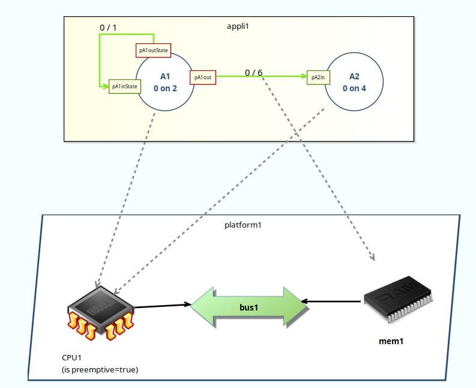
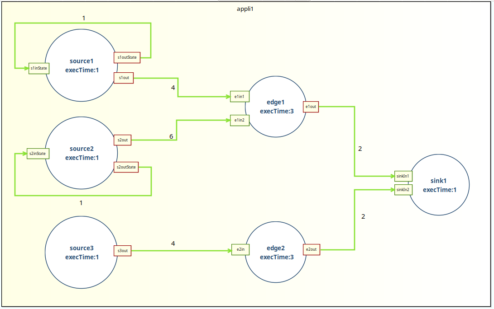
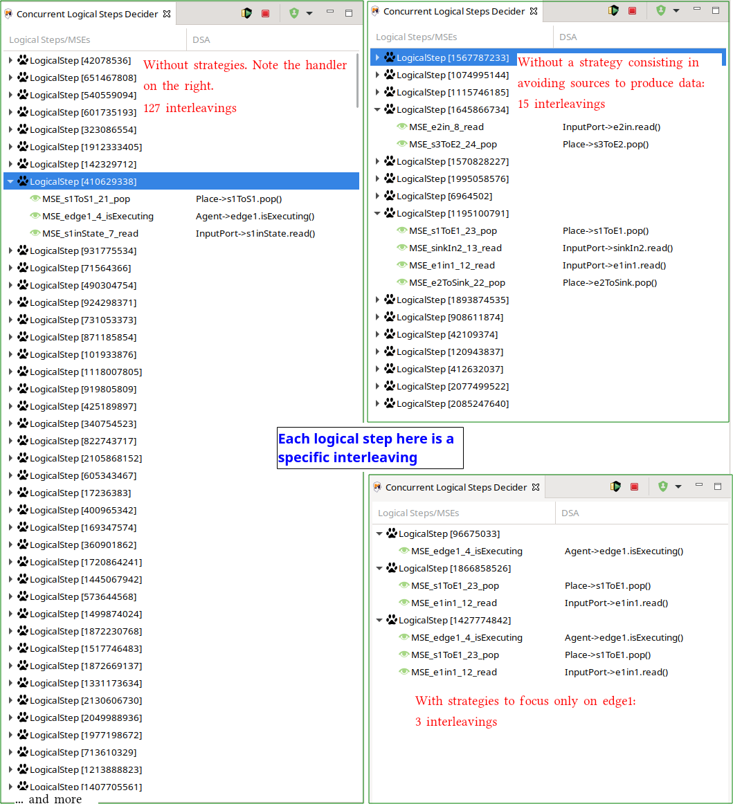

SigPML is a Domain Specific Modeling Language, inspired by process network languages, dedicated to data flow processing. The concrete syntax is based on *Agent*, *Port*s and *Connector*s. Agents defines input and output ports. Ports are linked by connectors, which represent FIFOs. The whole description defines a data flow. The DSML execution semantics defines that any agent can be executed as soon as the required input data are present. This means that there is potential concurrency between agent, with respect to the data flow. SigPML also supports a high level description of the hardware platform, allowing to deploy the Agents on Computational ressources and Connectors on Memory, restricting the potential concurrency of the application. Finally, a Computational resource can be defined as preemptive or not to abstract the behavior of an hypothetic operating system scheduler.  

The following Figure is a representation of a SigPML model as defined in the Sirius tool.

This is not required for an application to be deployed on a platform. for instance in the following picture we have an undeployed application.

When debugging such applications, the number of interleaving is high and can be cumbersome to manage. This is typically where strategies can be used to navigate in a pleasant way in the interleavings of interest. Below are three screenshots of the possible futures at a specfic point in time. On the left we have the possible futures without considering the use of strategies: this is non tractable. On top right, we used strategies to hide the solutions where *sources* where producing data. On the bottom right we used strategies to focus only on solution were rewriting rules are applied on *edge1* and its ports. This illustrates how strategies can be used to focus on a specific subset of the solutions, helping the user in a better understanding of its program.

 
